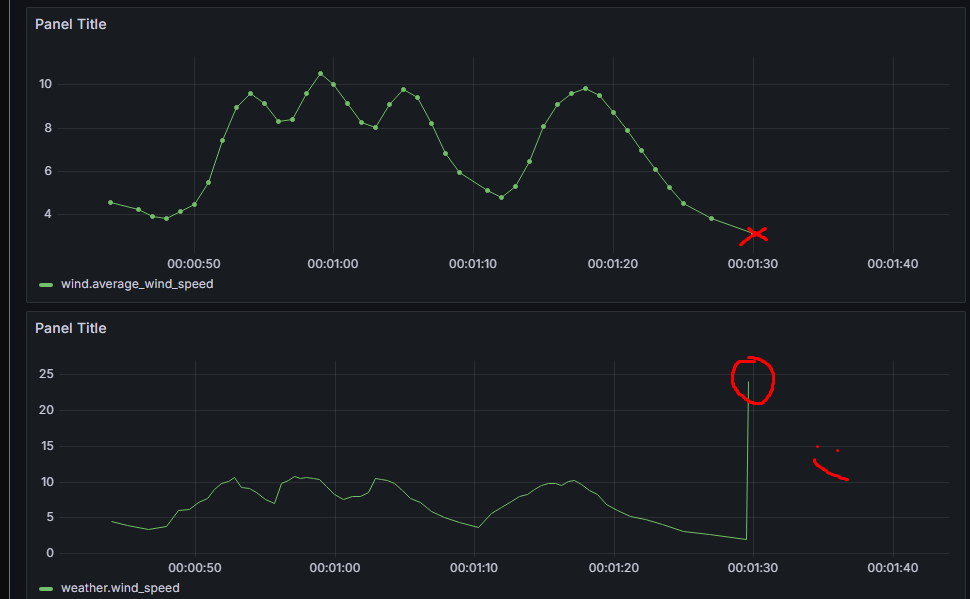
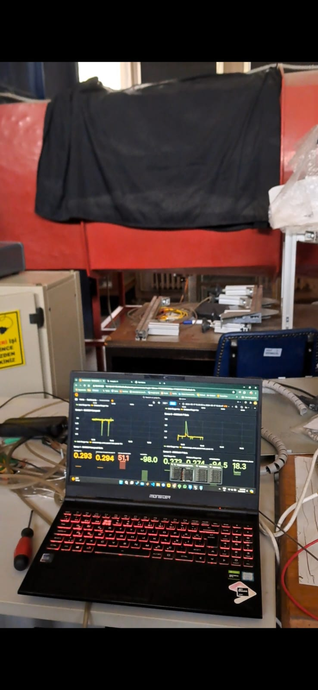

# 🌬️ Modern Anemometer with Raspberry Pi & 3D Printing  
**Real-Time Wind Speed Monitoring with Hall Effect Sensors, MCP3008, and Grafana**

This project presents a low-cost, customizable, and real-time wind measurement system developed using Raspberry Pi 5, Hall effect sensors, and 3D printing technology. It was designed and tested as part of an undergraduate **senior thesis** at Istanbul Technical University (ITU).  
> 📄 **Note**: The final thesis is written in **Turkish**.

---

## 📌 Project Summary

The system includes a custom-built cup anemometer, developed from scratch with:

- **3D-printed mechanical structure** for the rotating mechanism  
- **Hall Effect sensors** (Honeywell SS496A1 / Allegro A1203)  
- **MCP3008 ADC** for analog signal digitization  
- **Raspberry Pi 5** for data acquisition, processing, and transmission  
- **InfluxDB & Grafana** stack for data logging and real-time visualization  

It was tested in a wind tunnel for calibration and validated against professional-grade instruments.

---

## 🧠 Features

- ✅ Live wind speed measurement  
- ✅ Real-time data logging to InfluxDB  
- ✅ Filtering with moving averages & outlier detection  
- ✅ Conversion factor auto-calibration  
- ✅ Dynamic visualization with Grafana dashboards  
- ✅ Tested and validated in wind tunnel conditions

---

## 🛠️ System Components

| Part                      | Description                                     |
|---------------------------|-------------------------------------------------|
| Raspberry Pi 5 (8GB RAM)  | Core processing and logging unit               |
| Hall Effect Sensors       | Honeywell SS496A1 & Allegro A1203              |
| MCP3008 ADC               | 10-bit analog-to-digital converter             |
| SKF 7203 BEP Bearing      | High-speed, low-friction rotary support        |
| Neodymium Magnet          | Triggering magnetic field                      |
| 3D Printed Housing        | Custom cup structure and sensor enclosure      |

---

## 🧾 Folder Structure

```
Modern-Anemometer/
│
├── firmware/                # Python scripts for data acquisition
│   ├── a1203_test.py
│   └── mcp_test.py
│
├── data/                    # Sample outputs & logs
│   ├── wind_data.xlsx
│   └── wind_data_query.xlsx
│
├── hardware/                # Device photos and CAD screenshots
│   ├── fusion_screenshot.png
│   ├── printed_parts.jpg
│   └── assembled_test.jpg
│
├── screenshots/             # Grafana dashboard and lab views
│   ├── grafana_output.png
│   └── trisonic_lab.jpg
│
└── README.md
```

---

## 🧪 How It Works

- Magnetic pulses from the rotating cups are detected via Hall sensors  
- These signals are digitized using MCP3008 and processed on the Pi  
- Wind speed is calculated based on the rotation interval and cup geometry  
- Filtered values are sent to InfluxDB  
- Grafana displays real-time speed, deviation, and conversion statistics  

---

## 🚀 To Run the Code

Ensure InfluxDB is running and use:

```bash
python3 a1203_test.py --speed 10
```

This will:
- Continuously monitor wind speed  
- Apply moving average filtering  
- Calculate deviation from known wind tunnel speed  
- Auto-suggest new calibration factors  

> You can modify test speed by changing `--speed` value (e.g., 5, 10, 15...).

---

## 📊 Visualization with Grafana

A dynamic Grafana dashboard was created to:
- Show live wind speed and trends  
- Monitor deviation spikes  
- Compare results across different sensors and speeds  



---

## 🧵 Testing & Validation

Tests were conducted in **ITU's Trisonic Wind Tunnel Lab**.  


- Data from custom anemometer was compared with wind tunnel reference  
- Conversion factors were tuned using deviation analytics  
- Sensor accuracy was quantified in controlled flow conditions

---

## 📈 Sample Data

Located in the `/data` folder:
- `wind_data.xlsx`: Raw time series sensor logs  
- `wind_data_query.xlsx`: Processed Grafana-exported visual dataset

---

## 🔍 Future Improvements

- 🌡️ Add temperature & humidity sensors  
- 📶 Enable MQTT-based wireless data publishing  
- ☔ Optimize for outdoor waterproof casing  
- 📦 Package into a deployable IoT station

---

## 👤 Author

**Atakan Yaman**  
Meteorological Engineering & Control Systems (Double Major)  
Istanbul Technical University  
- GitHub: [mmf-code](https://github.com/mmf-code)  
- LinkedIn: [linkedin.com/in/atakanyaman](https://www.linkedin.com/in/atakanyaman)
